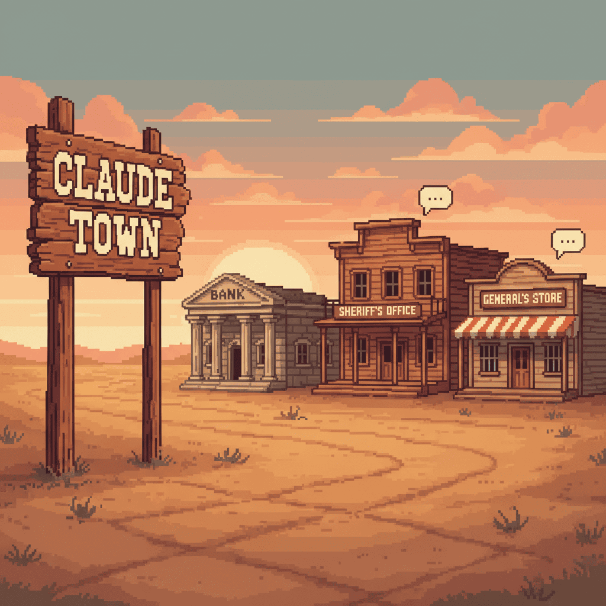
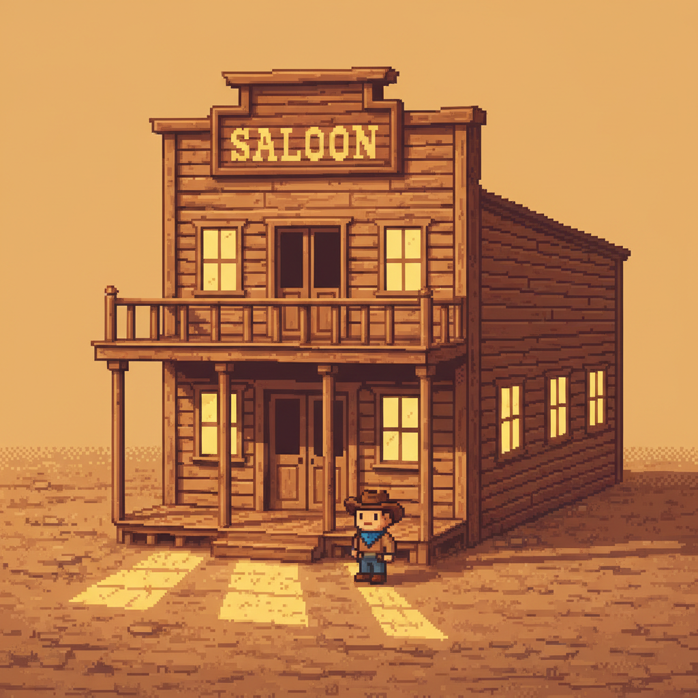
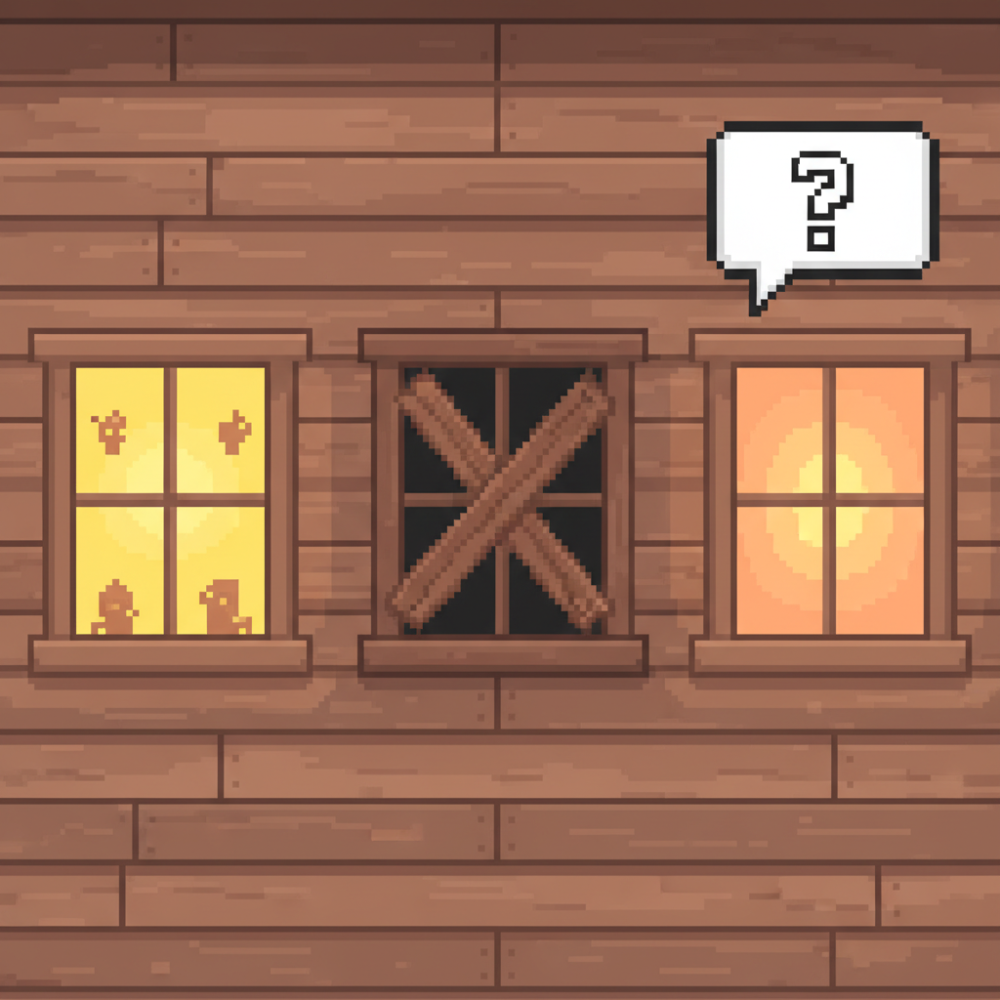
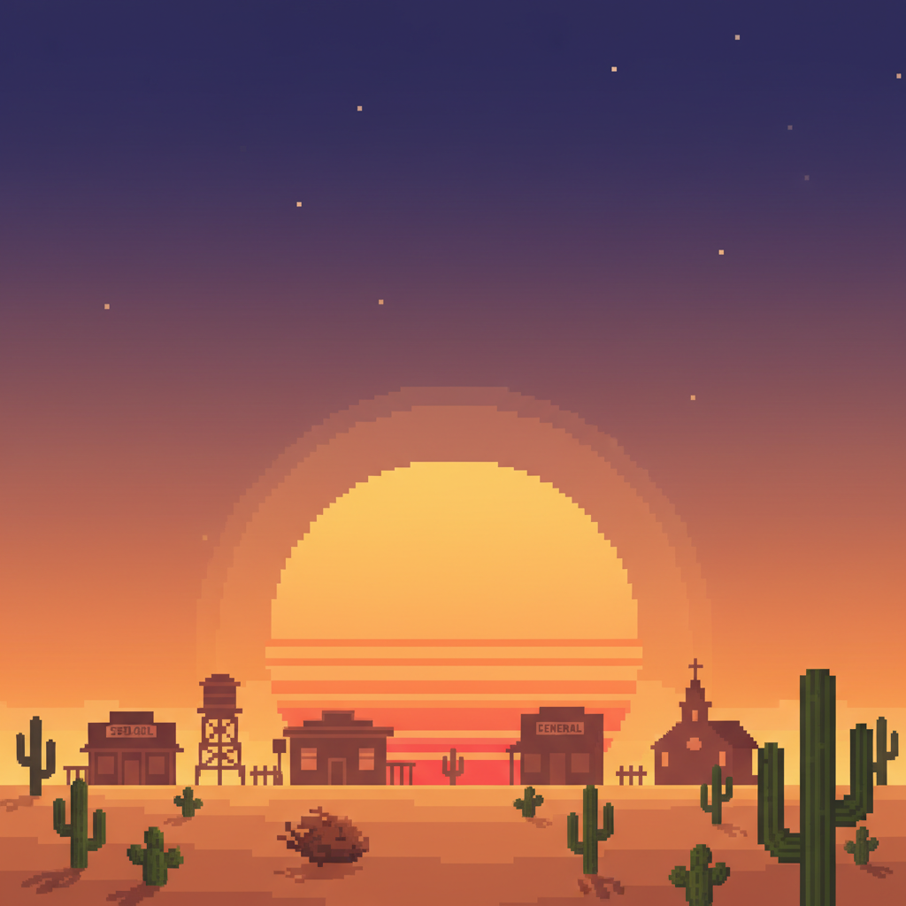

<p align="center">
  
</p>

<h3 align="center"><code>~ welcome to claude town, partner ~</code></h3>

<p align="center">
  A pixel art old-western town where your AI agents live, work, and holler when they need you.<br/>
  Built on the <a href="https://docs.anthropic.com/en/docs/agents/claude-agent-sdk">Claude Agent SDK</a>.
</p>

<p align="center">
  
  
  
  
</p>

---

## The idea

You spin up Claude agents. They work on your code. But instead of staring at terminal logs, you watch a little western town come to life.

Each **building** is a project. Each **floor** is an agent. When an agent needs you, a **speech bubble** pops up — click it, answer, and they get right back to work.

<p align="center">
  
</p>

## Reading the town



The buildings tell you everything at a glance:

| What you see | What it means |
|---|---|
| Flickering yellow windows | Agent is busy working |
| Boarded-up dark windows | Agent finished the job |
| Pulsing orange glow | Agent is waiting on you |
| Speech bubble floating above | Click me! Agent has a question |

No dashboards. No log-tailing. Just a town you can read like a book.

<br clear="right"/>

## Get it running

```bash
git clone https://github.com/yazinsai/town.git
cd town
bun install
```

```bash
cp .env.example .env
# Set TOWN_PASSWORD (or leave default: claude2024)
# Anthropic API key is picked up from ~/.claude/ automatically
```

```bash
bun run dev
```

Open **http://localhost:5173** — you're the new sheriff in town.

## How to use it

**Build something →** Click **+**, pick a project, choose a building style (saloon, bank, sheriff office...), write a prompt, and watch your agent get to work.

**Check in →** Windows glow and flicker as agents work. You can feel the activity without opening anything.

**Respond →** Speech bubble? Click it. Quick-response panel lets you answer and get back to watching the sunset.

**Go deeper →** Click any building to expand it — full conversation logs, streaming output, spawn more agents on the same project.

**Each agent gets its own git worktree**, so multiple agents can work on the same repo without stepping on each other. When they finish, changes merge back automatically.

## What's under the hood

```
Frontend (React 19 + Vite)         Backend (Hono + Bun)
  ├── Pixel art town scene           ├── Claude Agent SDK sessions
  ├── CSS-rendered building sprites  ├── File-based JSON storage
  ├── Day/night cycle + sounds       ├── Git worktree isolation
  ├── Quick-response panels          ├── Auto-merge on completion
  └── WebSocket client               └── WebSocket broadcasts
```

**Real-time** — WebSocket pushes every state change, message, and event to all connected clients. No polling.

**Resumable** — Send feedback to a completed agent and it picks back up with full conversation context via the SDK's `resume` option.

**Isolated** — Each agent works in its own git worktree. No merge conflicts between agents. Changes merge back when the job is done.

## The stack

| Layer | Tech |
|---|---|
| Runtime | [Bun](https://bun.sh) |
| Backend | [Hono](https://hono.dev) |
| Frontend | React 19, Vite, Tailwind CSS v4 |
| Agents | [@anthropic-ai/claude-agent-sdk](https://www.npmjs.com/package/@anthropic-ai/claude-agent-sdk) |
| Font | [Press Start 2P](https://fonts.google.com/specimen/Press+Start+2P) |
| Aesthetic | Pure vibes |

## Building styles

Your agents deserve nice offices. Pick from 8 hand-crafted pixel art buildings:

**Saloon** · **Bank** · **Sheriff Office** · **General Store** · **Hotel** · **Masjid** · **Blacksmith** · **Post Office**

Each one is rendered entirely in CSS. No image sprites. No canvas. Just divs with dreams.

---

<p align="center">
  
</p>

<p align="center">
  <sub>MIT License — saddle up and make it your own</sub>
</p>
